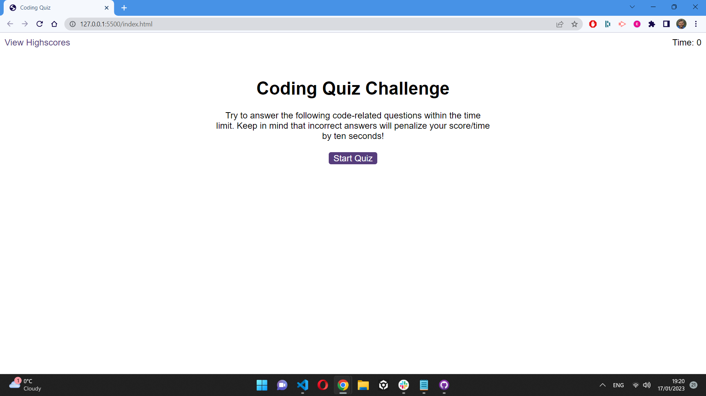

# Code Quiz

## Description

Timed coding quiz with multiple-choice questions about JavaScript coding language.

## User Story

AS A coding boot camp student 
I WANT to take a timed quiz on JavaScript fundamentals that stores high scores 
SO THAT I can gauge my progress compared to my peers

## Acceptance Criteria

GIVEN I am taking a code quiz 
WHEN I click the start button 
THEN a timer starts and I am presented with a question 
WHEN I answer a question 
THEN I am presented with another question 
WHEN I answer a question incorrectly 
THEN time is subtracted from the clock 
WHEN all questions are answered or the timer reaches 0 
THEN the game is over 
WHEN the game is over 
THEN I can save my initials and score 

## Installation

After opening this url: https://pav85.github.io/quiz-game/

you should see this in your browser:

## Licence

MIT Licence

## Questions

If you have any questions about this project please contact me directly at pawel.werbowy@gmail.com. If you would like to take a look at more of my work please click on the following link: https://github.com/Pav85. Thank you.

 
 

